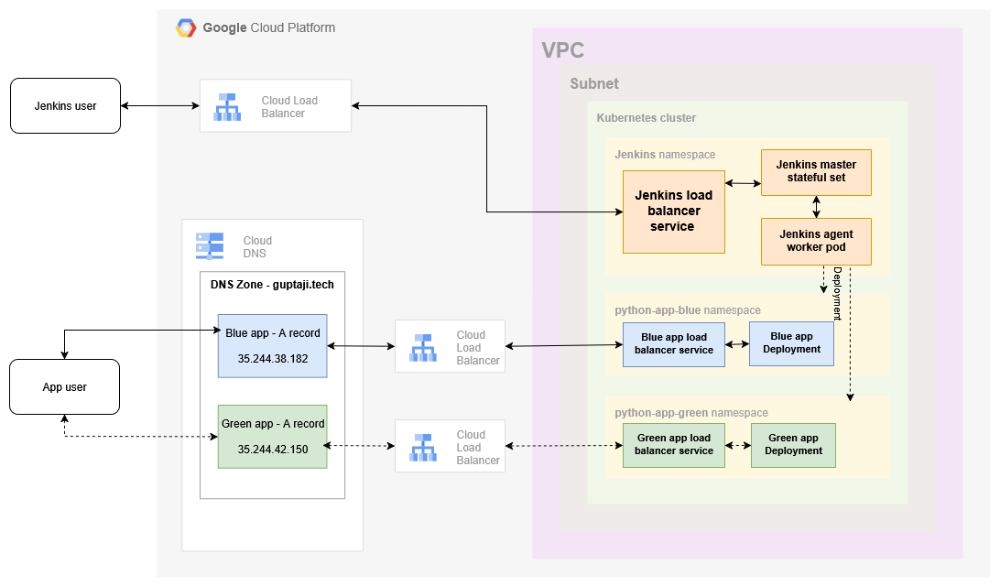

# guptaji-tech-allianz

> A secure and scalable CI/CD-enabled Kubernetes deployment on **Google Cloud Platform (GCP)** using **Jenkins**, **Terraform**, and **Blue-Green Deployment** strategy.

---

## 📑 Table of Contents

- [🧰 Tech Stack](#-tech-stack)
- [📌 Architecture Overview](#-architecture-overview)
- [🔧 Infrastructure Design](#-infrastructure-design)
- [🚀 CI/CD Pipeline Flow](#-cicd-pipeline-flow)
- [🛠️ Implementation Steps](#️-implementation-steps)
- [🔐 Security Measures](#-security-measures)
- [📈 Scalability and Cost Considerations](#-scalability-and-cost-considerations)
- [📎 Repository Structure](#-repository-structure)
- [🌐 Application Access](#-application-access)

---

## 🧰 Tech Stack

- **Cloud**: Google Cloud Platform (GCP)
- **CI/CD**: Jenkins (Helm-based), GitHub Webhooks
- **Containerization**: Docker, Docker Hub
- **Kubernetes**: GKE and Load Balancer Services
- **IaC**: Terraform
- **App Framework**: Python Flask

---

## 📌 Architecture Overview



---

## 🔧 Infrastructure Design

- **GCP Components**:
  - VPC, Subnet
  - GKE (zonal cluster)
  - Cloud NAT (private nodes connectivity)
  - Cloud Load Balancer
  - Cloud DNS (custom domain: `guptaji.tech`)

- **Namespaces**:
  - `jenkins` - Jenkins master and agent pods
  - `guptaji-tech-allianz-blue` - Blue version of the app
  - `guptaji-tech-allianz-green` - Green version of the app

- **Deployment Mode**:
  - Blue-Green Deployment strategy via Jenkins pipeline
  - Load Balancer IP switch via DNS A record update

---

## 🚀 CI/CD Pipeline Flow

1. **Webhook** triggers Jenkins job on GitHub commit
2. Jenkins agent builds Python app image, pushes to Docker Hub
3. Jenkins deploys selected app (blue/green) on GKE
4. Jenkins Cloud DNS A record to point `guptaji.tech` to new Load Balancer IP

---

## 🛠️ Implementation Steps

This section provides a **comprehensive guide** to build and deploy the infrastructure and Python application using **Terraform, Docker, Kubernetes, and Jenkins CI/CD** on **GCP**.

### 1. 🔨 Clone the Repository

```bash
git clone https://github.com/guptatrng/guptaji-tech-allianz.git
cd guptaji-tech-allianz
```

### 2. ☁️ Provision Infrastructure using Terraform

```bash
cd terraform
terraform init
terraform plan
terraform apply
```

> ⚠️ Authentication tp GCP can be done via `gcloud auth application-default login`.

### 3. 🧱 Build Jenkins Agent Docker Image

```bash
cd ../jenkins
docker build -t guptatrng/guptaji-tech-allianz-jenkins-agent:v4 .
docker push guptatrng/guptaji-tech-allianz-jenkins-agent:v4
```

📁 Reference: [`jenkins/dockerfile`](https://github.com/guptatrng/guptaji-tech-allianz/blob/main/jenkins/dockerfile)

### 4. 🚀 Deploy Jenkins on GKE via Helm

```bash
helm repo add jenkins https://charts.jenkins.io
helm repo update
helm install jenkins -n jenkins --create-namespace -f values.yaml jenkins/jenkins
```

📁 Reference: [`jenkins/values.yaml`](https://github.com/guptatrng/guptaji-tech-allianz/blob/main/jenkins/values.yaml)

### 5. 🐍 Prepare Python Flask Application

```bash
cd ../python-app
docker build -t guptatrng/guptaji-tech-allianz/blue:v2 .
docker push guptatrng/guptaji-tech-allianz/blue:v2
```

📁 Reference: [`python-app/`](https://github.com/guptatrng/guptaji-tech-allianz/tree/main/python-app)

### 6. 🔐 Configure Jenkins Credentials

Add the following in Jenkins:
- Docker Hub credentials
- GCP Service Account JSON key

### 7. 🧪 Set Up Jenkins Pipeline

Create Jenkins pipeline job with:
- SCM: GitHub
- Jenkinsfile path: `python-app/JenkinsFile`

📁 Reference: [`python-app/JenkinsFile`](https://github.com/guptatrng/guptaji-tech-allianz/blob/main/python-app/JenkinsFile)

### 8. 🔄 Connect GitHub Webhook

- URL: `http://34.93.110.174/github-webhook/`
- Content Type: `application/json`
- Event: Push

### 9. 📄 Update Deployment Control File

```bash
echo "blue" > python-app/blue-green-control.txt
git add .
git commit -m "Deploy blue version"
git push origin main
```

### 10. ✅ Verify Deployment

- Open: [http://guptaji.tech](http://guptaji.tech)
- Verify DNS A record points to correct Load Balancer IP

### 11. 🔁 Repeat for Blue/Green Switch

Change control file to `green`, push commit, and observe pipeline switch.

---

## 🔐 Security Measures

- ✅ Private GKE Nodes (no public IP)
- ✅ Outbound via Cloud NAT
- ✅ Credentials securely stored in Jenkins

🛡️ [To Be Implemented]:
- SSL for `guptaji.tech`
- Internal-only Jenkins LoadBalancer
- Cloud Armor or WAF
- IAM & RBAC hardening

---

## 📈 Scalability and Cost Considerations

- ✅ Node Autoscaling enabled

🛠️ [Can be Added]:
- HPA for app pods
- Pod Disruption Budgets
- Regional clusters
- ArgoCD GitOps
- Scale down backup/contingency application – Blue or Green for cost saving

---

## 📎 Repository Structure

```
├── terraform/                    
├── jenkins/
│   ├── dockerfile                
│   └── values.yaml              
├── python-app/
│   ├── JenkinsFile              
│   ├── blue-green-control.txt   
│   ├── blue/                    
│   └── green/                   
```

---

## 🌐 Application Access

- URL: [http://guptaji.tech](http://guptaji.tech)
- DNS toggled via `blue-green-control.txt` deployment file

---

## 🧠 Author

[Tarang Gupta](https://github.com/guptatrng)